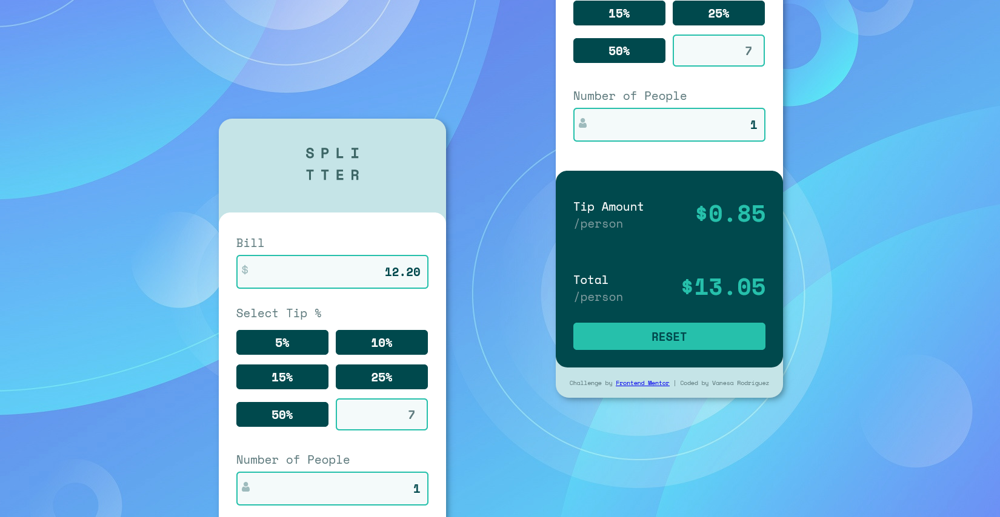

## Table of contents
- [Screenshots](#screenshots)
- [Built with](#built-with)
- [What I learned](#what-i-learned)
- [The challenge](#the-challenge)
- [Author](#author)


### Screenshots

#### Screenshot mobile


#### Screenshot desktop


## Built with
- Semantic HTML5 markup
- CSS custom properties
- Flexbox
- Mobile-first workflow
- JavaScript

**Wanna look how it works?** 
[Check it out!](https://vanesa-r.github.io/tip-calculator-app/) :point_left:

## What I learned

I discovered data- attribute.  It enabled  me to store additional information in the HTML elements.

```html
       <input type="button" class="tip" data-btn-tip="5" value="5%">
```

I discovered the CSS property caret-color. It enabled me to give more complete styles to the inputs.

```css
.input__text {
  caret-color: hsl(172, 67%, 45%);
}
```

The best thing about this challenge has been to give functionality to the app with JavaScript: DOM manipulation, arrow functions, methods ..

```js
const clean = () => {
       if (enabledReset){
             reset.addEventListener("click", () => {
                     bill.value = "";
                     people.value = "";
                     custom.value = "";
                     tips.forEach(tip => {
                            tip.classList.remove("tip--selected");
                            tipSelected = "";
                     })
                     empty(); 
                     states();
             })
       }
}
```

## The challenge

Users should be able to:

- View the optimal layout for the app depending on their device's screen size
- See hover states for all interactive elements on the page
- Calculate the correct tip and total cost of the bill per person

## Author

Vanesa Rodríguez
